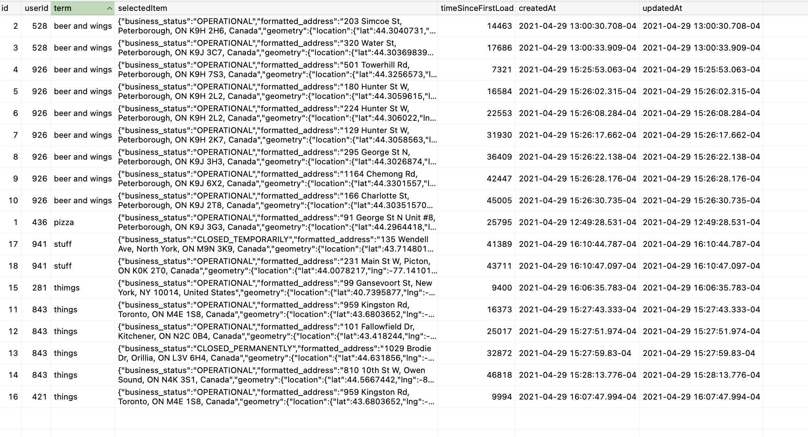

## Access Now

### Client

Used React instead of React Native so there are no bonus points for me there.

My React Native experience is limited to tutorials which I haven't used it in approximately 3 years. However, I
anticipate that it would take me no more than a couple of weeks to get up to speed.

I have used Cypress before but unfortunately didn't find the time to implement any end-to-end tests.

Caching is implemented in the App component to avoid saving duplicate selections.

### Server

I have been using noSQL databases (Mongo) almost exclusively for the past 4 years and had never used Postgres or
Sequelize before. In the past I have used MySQL with Knex ORM. It seemed fairly straight forward so hopefully my code
isn't too ugly.

There are no tests written for the server. It is really straight forward with little code to test. Not that that's ok
just ran out of time completing other aspects of the app.

### ENV

The client requires a .env file in its root directory with a value for REACT_APP_GOOGLE_KEY. I will send mine along with
the email.

The server requires a .env file in its root directory with values for DB_USER and DB_PASS. I used a local Postgres
instance for data storage.

### Start Up

Client - in access_now/client use `npm start` to start the client. Tests can be run with `npm test`.

Server - in access_now/server use `npm start` to start the server. Ensure that there is a local Postgres instance
running. The database and Search table should be created on start up.